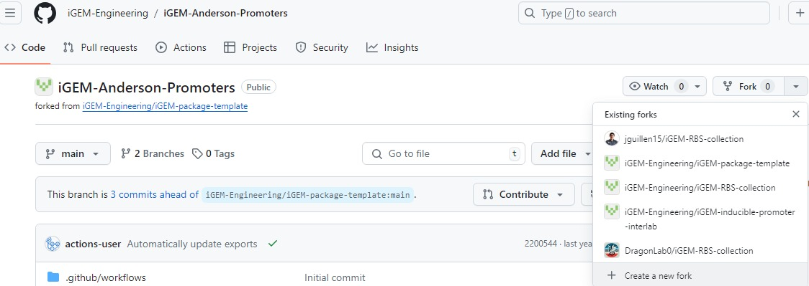
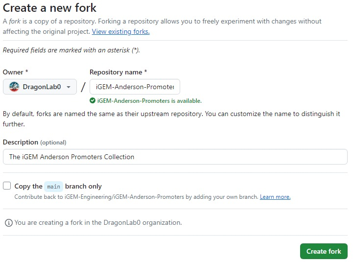
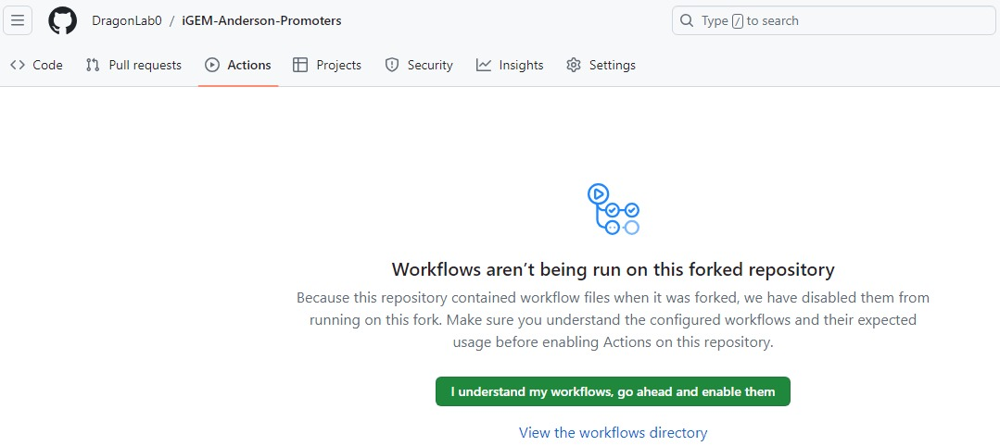
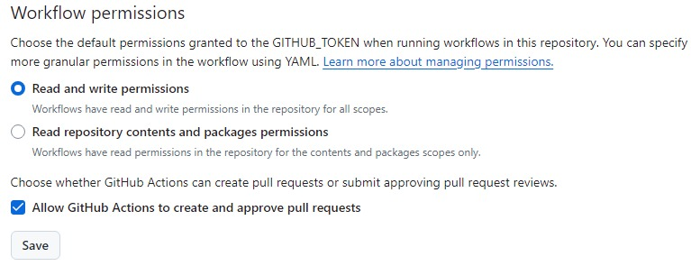
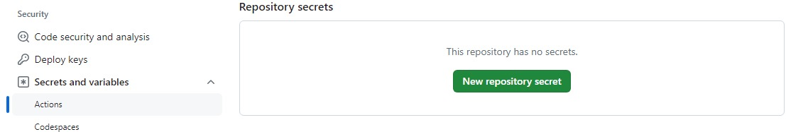
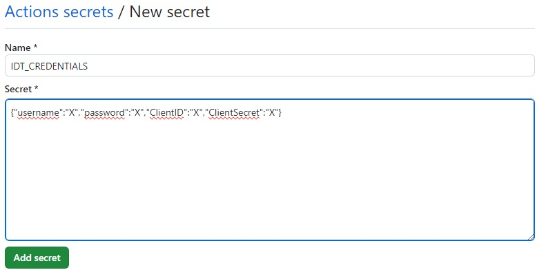

Hi 👋

## Overview
The work done can be found mainly in two repositories, the [iGEM Package Template](https://github.com/iGEM-Engineering/iGEM-package-template/tree/gsoc2024) and the [iGEM Actions](https://github.com/jguillen15/iGEM-actions/tree/gsoc_new) repository, both part of the [iGEM Engineering Organization](https://github.com/iGEM-Engineering). The two repositories are intended to work together. The [iGEM Actions](https://github.com/jguillen15/iGEM-actions/tree/gsoc_new) repository contains the GitHub actions and scripts required to processs and build the iGEM distribution packages.
The aim of this package is to simplify the package creation process, streamline package development and ensure the robust creation and utilization of the iGEM distribution.

The [iGEM Package Template](https://github.com/iGEM-Engineering/iGEM-package-template/tree/gsoc2024) repository serve as a template for anyone that wants to create a new one. This repository calls the iGEM Actions one and activates the corresponding GitHub Actions on this repo. Two succesful examples of this template can be found in the [Anderson Promoters Collection](https://github.com/iGEM-Engineering/iGEM-Anderson-Promoters) and the [iGEM RBS Collection](https://github.com/iGEM-Engineering/iGEM-RBS-collection) package.

# Steps
Please follow these next steps to succesfully use the tool.
## 1. Fork the iGEM Package Template repository
Go to the [iGEM Package Template](https://github.com/iGEM-Engineering/iGEM-package-template/tree/gsoc2024) repository and fork it. Here, an example with the [Anderson Promoters Collection](https://github.com/iGEM-Engineering/iGEM-Anderson-Promoters) is displayed, as the template itself is blank.

Make sure to fork all the branches.

## 2. Set up the repository
Go to the **Actions** tab in your forked repository and click on **I understand my workflows, go ahead and enable them**

Now, please go to the **Settings** tab. Then, on the left-hand side panel, go to **Actions->General**, and make sure the workflow has reading and and writing permissions. Also, check the box that says **Allow GitHub Actions to create and approve pull requests**, this will be needed to update the files in the repository.

## 3. Set up IDT Credentials GitHub Secret
Finally, to check the synthesizability of your sequences by computing the complexity scores, you will need to set up a GitHub secret with your [Integrated DNA Technologies(IDT)](https://www.idtdna.com/pages) account credentials. As the software tool uses the IDT API, If you don't have an account, you will need to [create one](https://www.idtdna.com/site/Account/AccountSetup). 

Provide the requested information in the following format

Now, all is set up and the tool is ready to use.

## Future Work

All the developed code is not hosted on the main branch of the [iGEM Actions](https://github.com/iGEM-Engineering/iGEM-actions) and the [iGEM Package Template](https://github.com/iGEM-Engineering/iGEM-package-template) repositories. As future work, the changes made will merge with the main branch. Also, a local version of the SBOL utility [calculate_complexity_scores.py](https://github.com/SynBioDex/SBOL-utilities/blob/develop/sbol_utilities/calculate_complexity_scores.py) is being used, as the latest release of SBOL Utilities does not contain this script. So, as soon the new release comes out, the local script will be removed from the repository and the new released version will be used instead.
