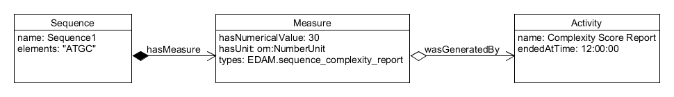

Hi 👋

## Overview

The idea of the [complexity scores calculator SBOL utility](https://github.com/SynBioDex/SBOL-utilities/blob/develop/sbol_utilities/calculate_complexity_scores.py) is to compute a value that determines if a DNA sequence is synthesizable or not. It uses the SBOL standard as a way to store the computed values with their corresponding metadata.

The script communicates with the [Integrated DNA Technologies (IDT) API](https://www.idtdna.com/site/order/gblockentry) to calculate the complexity scores of sequences. This system uses the gBlock API, which is intended for sequences from 125 to 3000 base pairs(bp) in length. If it is more than 3000 bp or less than 125 bp your returned score will be 0. A complexity score in the range from 0 to 10 means your sequence is synthesizable, if the score is greater or equal than 10 means it is not synthesizable.

You will need to set up your account with IDT to get your username, password, Client ID and Client Secret key, all necessary to use the tool. Please see their [documentation](https://www.idtdna.com/pages/tools/apidoc)

The script takes as an input an SBOL document with the DNA sequences in it, and returns a document with the sequences synthesis complexity scores annotated plus some relevant metadata, for instance, timestamps.

Complexity Scores in an SBOL document can be annotated with creation and modification dates, as well as with an associated identity. We can generate an **Activity** component with the report identification and timestamp. After adding the score to the SBOL document as a **Measure** of the **Sequence** component, we can link both objects using the **prov:wasGeneratedBy** property. For the unit of the measurement we can use the [OM-Ontology of Units of Measure](http://www.ontology-of-units-of-measure.org/), specifically using [number unit](http://www.ontology-of-units-of-measure.org/resource/om-2/NumberUnit) and for its type we can make use of the [EDAM - Bioscientific Data Analysis Ontology](https://bioportal.bioontology.org/ontologies/EDAM), particularly using [Sequence complexity report](https://bioportal.bioontology.org/ontologies/EDAM/?p=classes&conceptid=http%3A%2F%2Fedamontology.org%2Fdata_1259).

