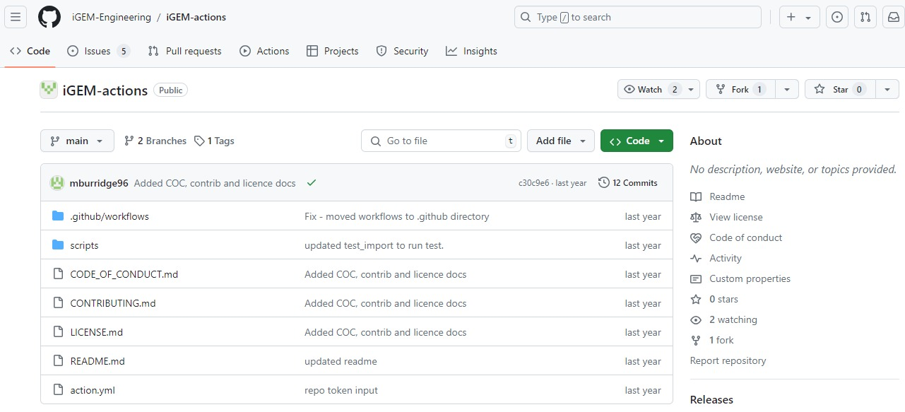

Hi 👋

## Overview

There is a [centralized page](https://github.com/iGEM-Engineering/iGEM-actions) that manages the iGEM Engineering organization GitHub Actions.

The idea is that the different iGEM packages(i.e. Plants, Anderson Promoters) have their own repository and within this, it will call the iGEM Actions.

Let's breakdown the code in the [action.yml](https://github.com/iGEM-Engineering/iGEM-actions/blob/main/action.yml) file that is in the repository. This file is in charge or running the actions when they are called from other repositories.

