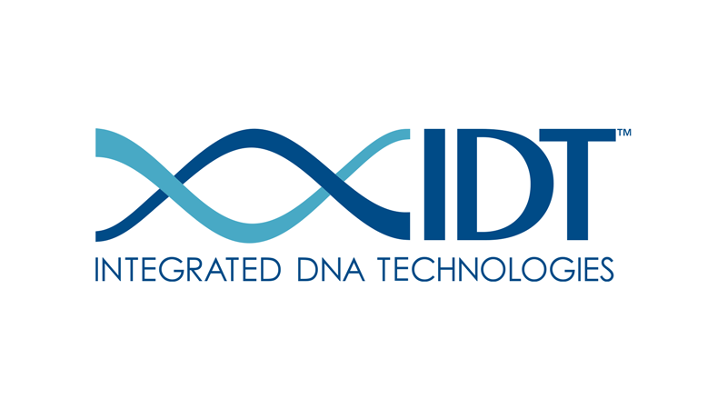

Hi 👋

## Overview

The complexity scores calculator SBOL utility uses the SBOL standard as a way to stored the computed values.
Let's break down what the code does:

- The script communicates with the Integrated DNA Technologies (IDT) API to calculate the complexity scores of sequences.

